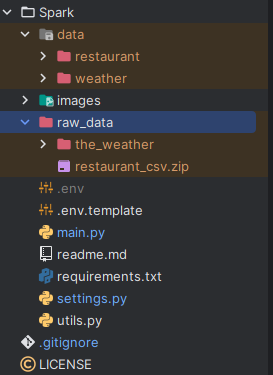

# EPAM BIG DATA - SPARK PRACTICE

Spark practice solution implemented using PySpark 

### Install dependencies using pip

```bash
pip install -r requirements.txt
```

### Usage

```bash
python main.py
```

### Description / Steps done
#### Project Structure 

#### 1. Data Preparation
1. Prepare restaurant data
   - Download `restaurant` data and unzip it manually to `data/restaurant` directory
2. Prepare weather data
   - Download `weather` data and put it to `the_weather` folder (as on image above)
   - Run function utils.unzip_files() with the data 
