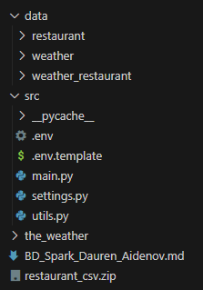

# EPAM BIG DATA - SPARK PRACTICE

Spark practice solution implemented using PySpark  
[Project Link](https://github.com/daurepchik/epam_big_data/tree/main/Spark)

### Prerequisites
#### Install modules using pip
```bash
pip install -r requirements.txt
```
#### Install Spark
1. Install Spark
2. Install Hadoop winutils
3. Install Java
4. Configure Environment variables

### Usage

```bash
python main.py
```

### Description / Steps done
#### Project Structure 

#### 1. Data Preparation
1. Prepare restaurant data
   - Download `restaurant` data and unzip it manually to `data/restaurant` directory
2. Prepare weather data
   - Download `weather` data and put it to `the_weather` folder (as on image above)
   - Run `python utils.py`
#### 2. Task implementation
1. Implementing UDFs
   - `utils.fill_null_lat_lng()` function accepts city and country parameters and returns 
   latitude and longitude
   - `utils.get_geohash()` generates a 4 character long geohash based on latitude and longitude coordinates
2. Reading and transforming restaurant data
   - `main.get_restaurant_df()` reads restaurant data from prepared CSV files under `data/restaurant` folder
   - Get new df with NA values for latitude and longitude
   - Fill that NA values with the data generated from `utils.fill_null_lat_lng()` UDF
   - Left join original DF with the DF with filled lat and lng values
   - Generate geohash column with `utils.get_geohash()` UDF
3. Reading and transforming weather data
   - `main.get_weather_df()` reads weather data from prepared PARQUET files under `data/weather` folder
   - Generate geohash column with `utils.get_geohash()` UDF
   - Reduce the number of similar data by grouping by 'geohash', 'year', 'month', 'day' 
   to reduce the join operation in the next step
4. Joining and exporting the data
   - `main.export_joined_df()` function left joins weather data with restaurant data
   - Partitions data by year, month, day and 
   exports the joined data to the `data/weather_restaurant` folder in PARQUET format
#### 3. Tests run
   - run `python test_pyspark.py`
   - If 'Tests passed' is printed, then tests are passed. Otherwise, tests are not passed